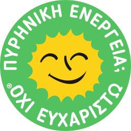

# Nuclear Power? No Thanks

The __Nuclear Power? No Thanks__ logo, an international symbol of the anti-nuclear movement. Originally designed by Anne Lund in 1975, and adapted by Michael Kolesidis.

## Languages

- English
- Greek (Ελληνικά)

## See Also

[Smiling Sun (Wikipedia)](https://en.wikipedia.org/wiki/Smiling_Sun)

## Contribution

The logo belongs to the community. Any contributions (improvements to the current logo or additional languages) are more than welcome!

## License

**[Attribution-ShareAlike 4.0 International (CC BY-SA 4.0)](https://creativecommons.org/licenses/by-sa/4.0/deed.en)**

**You are free to:**

**Share** — copy and redistribute the material in any medium or format

**Adapt** — remix, transform, and build upon the material for any purpose, even commercially.

This license is acceptable for Free Cultural Works. The licensor cannot revoke these freedoms as long as you follow the license terms.
